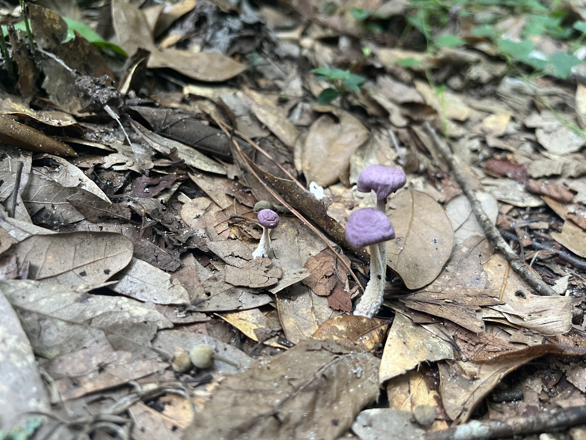
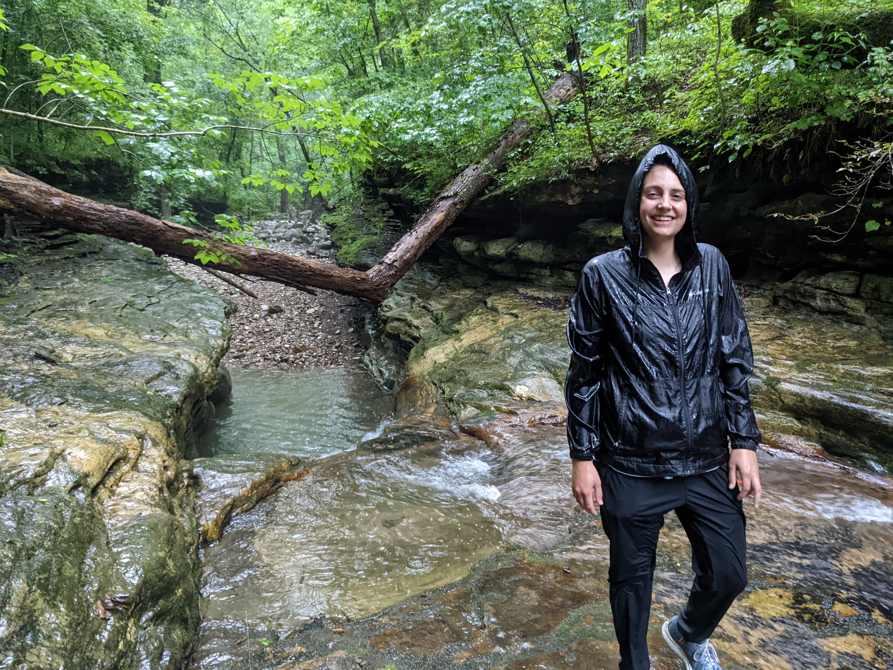

```{r setup, include=FALSE}
knitr::opts_chunk$set(message=FALSE,warning=FALSE, cache=TRUE)
```
## [About Me](https://magnoliamorelli.github.io) | [Research](https://magnoliamorelli.github.io/Research) | [Curriculum Vitae](https://magnoliamorelli.github.io/Curriculum_Vitae) | [Conferences](https://magnoliamorelli.github.io/Conferences) | [Assignments](https://magnoliamorelli.github.io/Assignments)

# The Ungulates
<p style="font-family: times; font-size:15pt">
Through my time at UVU, I have been involved in many research projects of my design. When I first started at school, I was pursuing a research project in Costa Rica. I was interested in the Howler monkeys and if/how they move around fungal spores. I was in contact with La Selva Biologcal Station for many years procuring permits and grants to travel to Costa Rica and collect my data. As the time went on, my project grew. I have now traveled to Arkansas and around Northern Utah to collect data on Elk and White-tailed deer for the same reason.
\
My project has evolved from one species of Howler monkeys to discovering if an entire new animal group, Ungulates, help facilitate the spread of different fungal colonies. In my remaining year at UVU I will travel to other regions of the world, such as Costa Rica and Japan, to gather data in different climates. This will allow me to analyze and produce a list of ungulates that are actively distributing viable fungal spores throughout an environment.
\
I have taken measures to outlaw any fungal spores that have come through other dispersal means such as wind or rain. I have gained skills in plating fungal spores, growing individual colonies, PCR, and sequencing. I have learned the trials of field work, communicated through government agencies to obtain permits, and written every grant that has allowed me to travel to these regions. As my project got delayed, changed paths, and became increasingly difficult through COVID, I have continued to pursue my passion and battle every obstacle that has come my way.
</p>

# Mushroom Unknown?
<p style="font-family: times; font-size:15pt">
As I was trekking through the Ozark Mountains looking for Elk dung, I came across an interesting mushroom. This mushroom was one my UVU mentor and I had never seen before. This got us thinking, what in the world had we just found? The mushroom looked strange and otherworldly. We needed to find out more information. Over the night my mentor scoured the internet and mycology books and found the mushroom to be Strobilomyces, Old Man of the Woods.
\
This began a path of wonder for me. I began to imagine all of the mushrooms that are not described or had their genome sequenced. This is an astronomical number that I plan to lessen, even if just a few. Strobilomyces has already been described but its genome has not yet been sequenced in full. In the last year of my UVU experience I will be working towards this goal. After sequencing I will work with a geneticist to pick out individual proteins to determine unique workings of the Old Man of the Woods. This process will guide me to learn new skills that I have not yet touched. I will learn new coding, new sequencing techniques, and new protein mechanisms.
</p>
\
\
```{r, echo=FALSE, out.width="30%", fig.cap="**Strobilomyces**"}

```
```{r, echo=FALSE, out.width="50%", fig.cap="**Field Work**"}

```

# Karyotypes
<p style="font-family: times; font-size:15pt">
During my lab rotations at UVU, I met Dr. Hjelmen. He had done previous work on a karyotype database with Dr. Blackmon. We got to talking about his work and passion for creating a larger database of different species and their karyotype and chromosome data. I became interested in this and asked him if I could be of any help. We worked together for a few months rearranging and organizing what he had found. I spent many hours writing up a journal article, while learning how karyotypes work and the importance of having the data in one place for other scientists to view.
\
The main takeaway from this experience was learning the process of writing a peer-reviewed article. From the beginnings of analyzing and organizing data to the very end of publication. I had written papers before but never on this scale. My writing went through multiple rounds of drafts, many professors and peers scrutinizing my work. I went through the steps of submitting my writing to an article and having comments returned. After more waiting than I had ever thought possible, our article was finally accepted for publication. You can view the article [here](https://www.frontiersin.org/articles/10.3389/fevo.2022.832378/full) and the database at www.karyotype.org.
</p>

