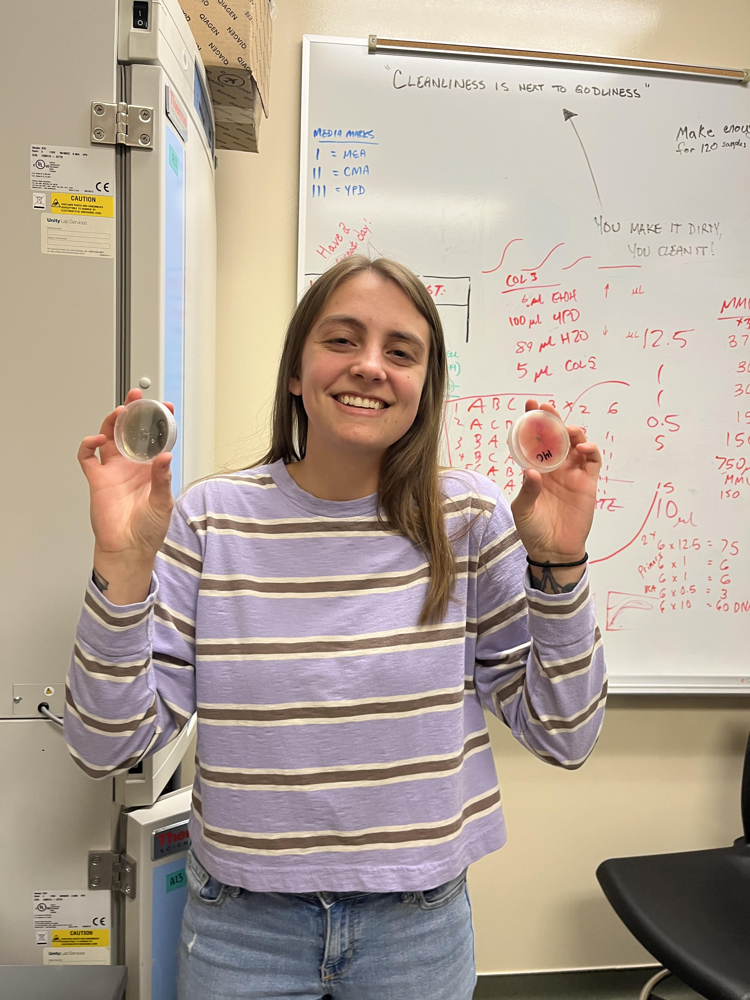

<header>
  <nav>
    <ul>
      <li><a href="index.html">Home</a></li>
      <li><a href="Curriculum_Vitae/index.html">Curriculum Vitae</a></li>
      <li><a href="Research/index.html">Research</a></li>
      <li><a href="Conferences/index.html">Conferences</a></li>
    </ul>
  </nav>
</header>
\
\

  
  <h2>Magnolia W Morelli</h2>
  

I am a biology student at Utah Valley University, set to graduate in Fall 2023. I received a National Science Foundation S-STEM fellowship, which enabled me to conduct my own research while attending school full-time. My primary interests are mycology, ecology, marine sciences, animal/environment interactions, and bioinformatics. I have taken various courses in coding techniques such as R, Python, and SQL. My goal is to broaden my knowledge, perspective, and research skills to eventually become a professor at an accredited university.
\
\
After graduation, I plan to pursue a Ph.D. and am currently searching for a mentor with a passion for teaching. If you like what you see on this page, please feel free to email me. My contact information can be found under the "CV" tab.
\
\
Please take your time browsing my other tabs to learn more about me, the techniques I've learned, and the research I have conducted. I have invested significant time and effort into creating this website using R studio, and I hope you find it enjoyable.
  

